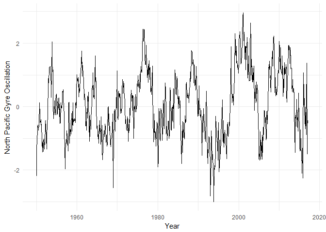

<!-- README.md is generated from README.Rmd. Please edit that file -->
[](https://travis-ci.org/boshek/rsoi) [](https://ci.appveyor.com/project/boshek/rsoi)[](https://cran.r-project.org/package=rsoi) [](https://CRAN.R-project.org/package=rsoi)

rsoi
----

An R package to download the most up to date Southern Oscillation Index, Oceanic Nino Index and North Pacific Gyre Oscillation data.

Installation
------------

``` r
install.packages("rsoi")

library(rsoi)
library(ggplot2)
```

Usage
-----

``` r
enso <- download_enso()
enso
#> # A tibble: 809 x 7
#>          Date  Year Month        ONI              phase   SOI       NPGO
#>        <date> <dbl> <ord>      <dbl>             <fctr> <dbl>      <dbl>
#>  1 1950-01-01  1950   Jan         NA                 NA    NA -2.1883951
#>  2 1950-02-01  1950   Feb -1.2100000 Cool Phase/El Nino    NA -1.4458314
#>  3 1950-03-01  1950   Mar -1.1066667 Cool Phase/El Nino    NA -0.9650357
#>  4 1950-04-01  1950   Apr -1.1566667 Cool Phase/El Nino    NA -0.8587880
#>  5 1950-05-01  1950   May -1.1066667 Cool Phase/El Nino    NA -0.6340822
#>  6 1950-06-01  1950   Jun -0.9166667 Cool Phase/El Nino    NA -0.5809843
#>  7 1950-07-01  1950   Jul -0.6433333 Cool Phase/El Nino    NA -0.7421143
#>  8 1950-08-01  1950   Aug -0.5766667 Cool Phase/El Nino    NA -0.5493842
#>  9 1950-09-01  1950   Sep -0.5400000 Cool Phase/El Nino    NA -0.6015450
#> 10 1950-10-01  1950   Oct -0.5600000 Cool Phase/El Nino    NA  0.1194343
#> # ... with 799 more rows
```

Or for index specific data use the argument:

``` r
soi <- download_enso(climate_idx = "soi")
soi
#> # A tibble: 797 x 5
#>          Date Month  Year   SOI SOI_3MON_AVG
#>        <date> <ord> <dbl> <dbl>        <dbl>
#>  1 1951-01-01   Jan  1951   1.5           NA
#>  2 1951-02-01   Feb  1951   0.9    0.7666667
#>  3 1951-03-01   Mar  1951  -0.1    0.1666667
#>  4 1951-04-01   Apr  1951  -0.3   -0.3666667
#>  5 1951-05-01   May  1951  -0.7   -0.2666667
#>  6 1951-06-01   Jun  1951   0.2   -0.5000000
#>  7 1951-07-01   Jul  1951  -1.0   -0.3333333
#>  8 1951-08-01   Aug  1951  -0.2   -0.7666667
#>  9 1951-09-01   Sep  1951  -1.1   -0.7666667
#> 10 1951-10-01   Oct  1951  -1.0   -0.9666667
#> # ... with 787 more rows
```

And we can plot these values using `ggpot2` nicely

``` r
ggplot(enso, aes(x = Date, y = NPGO)) +
  geom_line() +
  theme_minimal() +
  labs(x = "Year", y = "North Pacific Gyre Oscillation")
```



Inspired by
-----------

The idea for this package borrows heavily from the rpdo package. The initial efforts by these authors are gratefully acknowledged. The rpdo github page can be found here: [rpdo](https://github.com/poissonconsulting/rpdo)

Data Sources
------------

-   Southern Oscillation Index <https://www.ncdc.noaa.gov/teleconnections/enso/indicators/soi/>
-   Oceanic Nino Index data <http://www.cpc.ncep.noaa.gov/products/analysis_monitoring/ensostuff/detrend.nino34.ascii.txt>
-   Northern Pacific Gyre Oscillation <http://www.o3d.org/npgo/data/NPGO.txt>

Helpful References
------------------

[In Watching for El Niño and La Niña, NOAA Adapts to Global Warming](https://www.climate.gov/news-features/understanding-climate/watching-el-ni%C3%B1o-and-la-ni%C3%B1a-noaa-adapts-global-warming)

[L’Heureux, M. L., Collins, D. C., & Hu, Z.-Z. (2012, March.). Linear trends in sea surface temperature of the tropical Pacific Ocean and implications for the El Niño-Southern Oscillation. Climate Dynamics, 1–14. doi:10.1007/s00382-012-1331-2](https://link.springer.com/article/10.1007%2Fs00382-012-1331-2)

[The Victoria mode in the North Pacific linking extratropical sea level pressure variations to ENSO](http://onlinelibrary.wiley.com/doi/10.1002/2014JD022221/pdf)
