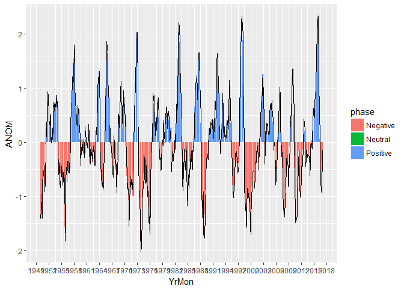
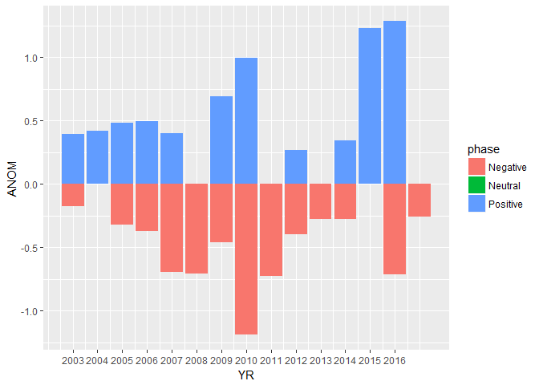

ENSO download
================
Sam Albers
March 30, 2017

Packages
--------

Install renso like so:

``` r
#devtools::install_github("boshek/renso")

library(ggplot2)
library(renso)
library(dplyr)
```

    ## 
    ## Attaching package: 'dplyr'

    ## The following objects are masked from 'package:stats':
    ## 
    ##     filter, lag

    ## The following objects are masked from 'package:base':
    ## 
    ##     intersect, setdiff, setequal, union

Some plotting examples
----------------------

``` r
download_enso() %>%
  ggplot(aes(x = YrMon, y = ANOM)) +
  geom_bar(aes(fill = phase), stat = 'identity') +
  geom_path() +
  scale_x_date(date_breaks = "3 year", date_labels = "%Y")
```

    ## YrMon formatted as date on the first of the month because R only supports one partial date time



``` r
download_enso() %>%
  filter(YR >= 2003) %>%
  group_by(YR, phase) %>%
  summarise(ANOM = mean(ANOM, na.rm = TRUE)) %>%
  ggplot(aes(x = YR, y = ANOM)) +
  geom_bar(aes(fill = phase), stat = 'identity') +
  scale_x_continuous(breaks = seq(2003, 2016, by = 1))
```

    ## YrMon formatted as date on the first of the month because R only supports one partial date time


